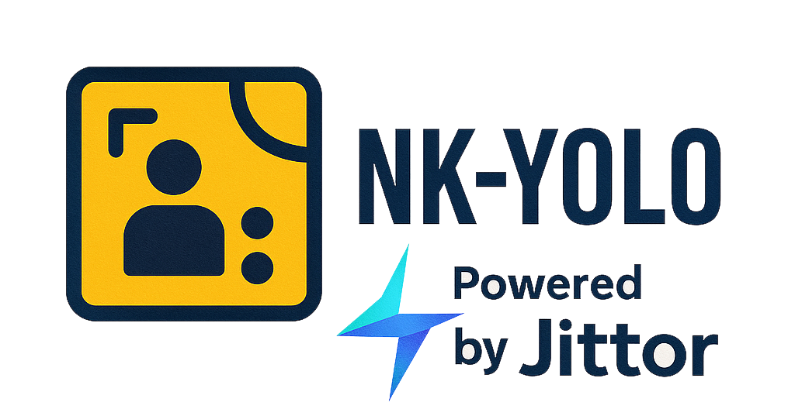

<div align="center">

  <a href="README.md">
    <br/>
  </a>


  [](https://github.com/FishAndWasabi/YOLO-MS/issues)
  [](https://github.com/FishAndWasabi/YOLO-MS/issues)

**NK-YOLO** is a comprehensive object detection benchmark built on [Jittor](https://github.com/Jittor/jittor), providing state-of-the-art YOLO implementations with automatic compilation and optimized performance.

[📖 Documentation](#) | [🚀 Quick Start](#getting-started) | [🎯 Models](#supported-models) | [📊 Results](#)

</div>

---

## ✨ Features

- 🔥 **Automatic Compilation**: No manual CUDA/C++ compilation required
- 🚀 **Multi-Model Support**: YOLOv5, YOLOv6, YOLOv7, YOLOv8, YOLOv10, YOLO-MS
- ⚡ **High Performance**: Optimized for speed and accuracy
- 🎯 **Easy Training**: Simple training pipeline with comprehensive configuration
- 📊 **Rich Evaluation**: Built-in validation and testing tools
- 🛠️ **Cross-Platform**: Support for Linux, macOS, and WSL

## 🎯 Supported Models

| Model | Paper | Repository | Status |
|-------|-------|------------|--------|
| **YOLOv5** | [Paper](https://arxiv.org/abs/2004.10934) | [ultralytics/yolov5](https://github.com/ultralytics/yolov5) | ✅ |
| **YOLOv6** | [Paper](https://arxiv.org/abs/2209.02976) | [meituan/YOLOv6](https://github.com/meituan/YOLOv6) | ✅ |
| **YOLOv7** | [Paper](https://arxiv.org/abs/2207.02696) | [WongKinYiu/yolov7](https://github.com/WongKinYiu/yolov7) | ✅ |
| **YOLOv8** | [Paper](https://arxiv.org/abs/2303.13601) | [ultralytics/ultralytics](https://github.com/ultralytics/ultralytics) | ✅ |
| **YOLOv10** | [Paper](https://arxiv.org/abs/2405.14458) | [THU-MIG/yolov10](https://github.com/THU-MIG/yolov10) | ✅ |
| **YOLO-MS** ⭐ | [Paper](https://arxiv.org/abs/2309.11656) | [FishAndWasabi/YOLO-MS](https://github.com/FishAndWasabi/YOLO-MS) | ✅ |

## 🛠️ Installation

### System Requirements

- **OS**: Linux (Ubuntu/CentOS/Arch), macOS, or Windows Subsystem for Linux (WSL)
- **Python**: >= 3.7
- **CPU Compiler**: g++ (>=5.4.0) or clang (>=8.0)
- **GPU Compiler** (Optional): nvcc (>=10.0 for g++ or >=10.2 for clang)
- **GPU Library**: cudnn-dev (recommended tar file installation)

### Step 1: Clone and Install Dependencies

```bash
git clone https://github.com/NK-JittorCV/nk-yolo.git
cd nk-yolo
python -m pip install -r requirements.txt
```

> 💡 **Note**: If you encounter Jittor installation issues, please refer to the [Jittor Installation Guide](https://github.com/Jittor/jittor).

### Step 2: Install NK-YOLO

```bash
# Option 1: Install in development mode
pip install -v -e .

# Option 2: Install with user permissions (if needed)
pip install -v -e . --user
```

## 🚀 Getting Started

### Quick Demo

```bash
python demo.py
```

This will:
1. Train a YOLOv8 model on COCO8 dataset for 2 epochs
2. Evaluate the model performance
3. Run inference on sample images

### Basic Usage

```python
from nkyolo import YOLO

# Load a model
model = YOLO('yolov8n.yaml')

# Train the model
results = model.train(
    data='coco8.yaml',
    epochs=100,
    imgsz=640,
    batch=16,
    device='cpu'  # or '0' for GPU
)

# Validate the model
metrics = model.val()

# Run inference
results = model('path/to/image.jpg')
results[0].show()
```

## 🎯 Training

### 1. Prepare Your Dataset

Create a YAML configuration file for your dataset:

```yaml
# dataset.yaml
path: ../datasets/coco  # dataset root directory
train: images/train2017  # train images (relative to 'path')
val: images/val2017      # val images (relative to 'path')

# Classes
names:
  0: person
  1: bicycle
  2: car
  # ... more classes
```

### 2. Training Commands

#### Basic Training
```bash
python -m nkyolo.models.yolo.detect.train \
    --model yolov8n.yaml \
    --data coco.yaml \
    --epochs 100 \
    --imgsz 640 \
    --batch 16 \
    --device cpu
```

#### Advanced Training Options
```bash
python -m nkyolo.models.yolo.detect.train \
    --model yolov8n.yaml \
    --data coco.yaml \
    --epochs 100 \
    --imgsz 640 \
    --batch 16 \
    --device 0 \
    --workers 8 \
    --patience 50 \
    --save-period 10 \
    --cache ram
```

### 3. Training Parameters

| Parameter | Description | Default |
|-----------|-------------|---------|
| `--model` | Model configuration file | `yolov8n.yaml` |
| `--data` | Dataset configuration file | `coco.yaml` |
| `--epochs` | Number of training epochs | `100` |
| `--imgsz` | Input image size | `640` |
| `--batch` | Batch size | `16` |
| `--device` | Device to run on (cpu/0/0,1,2,3) | `cpu` |
| `--workers` | Number of worker threads | `8` |
| `--patience` | Early stopping patience | `50` |
| `--save-period` | Save checkpoint every N epochs | `-1` |
| `--cache` | Cache images (ram/disk) | `False` |

### 4. Training with Different Models

```bash
# YOLOv8
python -m nkyolo.models.yolo.detect.train --model yolov8n.yaml
```

## 🧪 Testing & Evaluation

### 1. Model Validation

```bash
# Validate a trained model
python -m nkyolo.models.yolo.detect.train \
    --model ${CKPT_PATH} \
    --data coco.yaml \
    --task val
```

### 2. Inference

```python
from nkyolo import YOLO

# Load trained model
model = YOLO(${CKPT_PATH})

# Single image inference
results = model('path/to/image.jpg')
results[0].show()
results[0].save('output.jpg')

# Batch inference
results = model(['image1.jpg', 'image2.jpg', 'image3.jpg'])

# Video inference
results = model('video.mp4')
```

### 3. Performance Evaluation

```bash
# Evaluate model performance
python -m nkyolo.models.yolo.detect.train \
    --model runs/train/exp/weights/best.pt \
    --data coco.yaml \
    --task val \
    --conf 0.001 \
    --iou 0.6
```

## 📊 Model Performance

### YOLOv10 Models

| Model | Test Size | #Params | FLOPs | AP<sup>val</sup> | Latency |
|:------|:---------:|:--------:|:------:|:------------------:|:--------:|
| [YOLOv10-N](https://huggingface.co/jameslahm/yolov10n) | 640 | 2.3M | 6.7G | 38.5% | 1.84ms |
| [YOLOv10-S](https://huggingface.co/jameslahm/yolov10s) | 640 | 7.2M | 21.6G | 46.3% | 2.49ms |
| [YOLOv10-M](https://huggingface.co/jameslahm/yolov10m) | 640 | 15.4M | 59.1G | 51.1% | 4.74ms |
| [YOLOv10-B](https://huggingface.co/jameslahm/yolov10b) | 640 | 19.1M | 92.0G | 52.5% | 5.74ms |
| [YOLOv10-L](https://huggingface.co/jameslahm/yolov10l) | 640 | 24.4M | 120.3G | 53.2% | 7.28ms |
| [YOLOv10-X](https://huggingface.co/jameslahm/yolov10x) | 640 | 29.5M | 160.4G | 54.4% | 10.70ms |

## 📁 Project Structure

```
nk-yolo/
├── nkyolo/           # Main package
│   ├── cfg/             # Configuration files
│   │   ├── datasets/    # Dataset configurations
│   │   └── models/      # Model configurations
│   ├── data/            # Data loading and processing
│   ├── engine/          # Training engine
│   ├── models/          # Model implementations
│   ├── nn/              # Neural network modules
│   └── utils/           # Utility functions
├── datasets/            # Dataset storage
├── runs/               # Training outputs
├── demo.py             # Demo script
└── requirements.txt    # Dependencies
```

## 🤝 Contributing

We welcome contributions! Please see our [Contributing Guidelines](CONTRIBUTING.md) for details.

## 📄 License

This project is licensed under the AGPL-3.0 License - see the [LICENSE](LICENSE) file for details.

## 🙏 Acknowledgments

This project is built on top of these excellent open-source projects:

- [Jittor](https://github.com/Jittor/jittor) - Deep learning framework
- [ultralytics](https://github.com/ultralytics/ultralytics) - YOLOv8 implementation
- [yolov10](https://github.com/THU-MIG/yolov10) - YOLOv10 implementation

## 📚 Citation

If you find this work useful for your research, please cite:

```bibtex
@article{hu2020jittor,
  title={Jittor: a novel deep learning framework with meta-operators and unified graph execution},
  author={Hu, Shi-Min and Liang, Dun and Yang, Guo-Ye and Yang, Guo-Wei and Zhou, Wen-Yang},
  journal={Science China Information Sciences},
  volume={63},
  number={222103},
  pages={1--21},
  year={2020}
}

@article{Chen2025,
  title = {YOLO-MS: Rethinking Multi-Scale Representation Learning for Real-time Object Detection},
  ISSN = {1939-3539},
  url = {http://dx.doi.org/10.1109/TPAMI.2025.3538473},
  DOI = {10.1109/tpami.2025.3538473},
  journal = {IEEE Transactions on Pattern Analysis and Machine Intelligence},
  publisher = {Institute of Electrical and Electronics Engineers (IEEE)},
  author = {Chen, Yuming and Yuan, Xinbin and Wang, Jiabao and Wu, Ruiqi and Li, Xiang and Hou, Qibin and Cheng, Ming-Ming},
  year = {2025},
  pages = {1–14}
}

@article{wang2024yolov10,
  title={YOLOv10: Real-Time End-to-End Object Detection},
  author={Wang, Ao and Chen, Hui and Liu, Lihao and Chen, Kai and Lin, Zijia and Han, Jungong and Ding, Guiguang},
  journal={arXiv preprint arXiv:2405.14458},
  year={2024}
}
```

---

<div align="center">

**Made with ❤️ by the NK-YOLO Team**

[⭐ Star this repo](https://github.com/NK-JittorCV/nk-yolo) | [🐛 Report Issues](https://github.com/NK-JittorCV/nk-yolo/issues) | [📖 Documentation](#)

</div>
